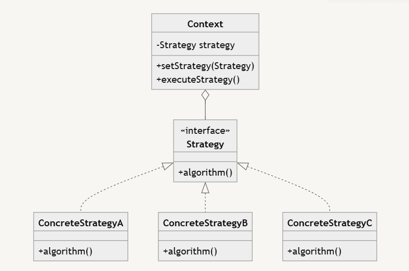

# Strategy Design Pattern

## What is Strategy Method Design Pattern?

The Strategy Method Design Pattern is a **behavioral design pattern** that enables selecting an algorithm's behavior at runtime. It defines a family of algorithms, encapsulates each one, and makes them interchangeable.

---

## Key Characteristics

- Defines a family of algorithms or behaviors.
- Encapsulates each algorithm into its own class.
- Makes the algorithms interchangeable within that family.
- Allows the algorithm to vary independently from the clients that use it.

---

## Benefits

- **Loose Coupling:** Promotes loose coupling between the algorithm and the code that uses the algorithm.
- **Flexibility:** Enables switching between different algorithms without changing the client code.
- **Simplicity:** Eliminates the need for complex conditional statements.
- **Extensibility:** Follows the **Open/Closed Principle**, allowing new strategies to be added without modifying existing code.

---

## Common Use Cases

- Payment processing systems (e.g., multiple payment methods like Credit Card, PayPal, Cryptocurrency).
- Sorting algorithms (e.g., Bubble Sort, Quick Sort, Merge Sort).
- Compression algorithms (e.g., ZIP, RAR, GZIP).
- Navigation systems (e.g., different routing strategies like fastest route, shortest route).

---

## UML Diagram

